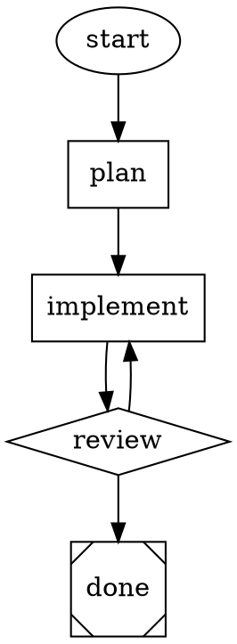
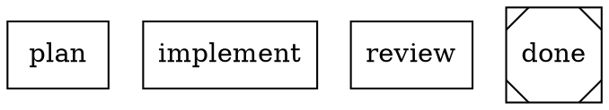
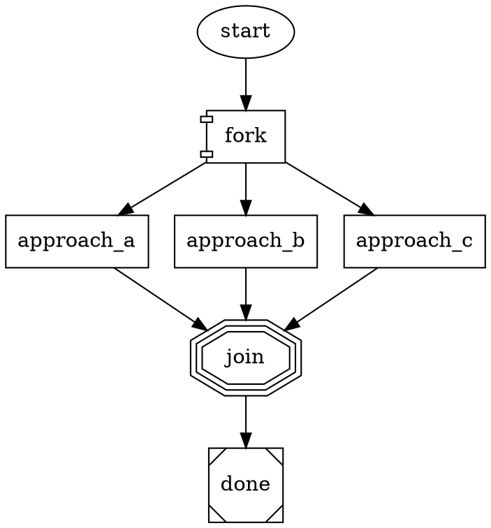

# Attractor

An implementation of [StrongDM's Attractor](https://github.com/strongdm/attractor) -- a DOT-based pipeline runner for orchestrating multi-stage AI workflows.

Attractor lets you define AI workflows as Graphviz DOT files. Each node in the graph is a task (LLM call, human review, conditional branch, shell command) and edges define the flow between them. The engine walks the graph, calling LLMs at each stage, branching on conditions, and producing results.



## What is this?

StrongDM published a set of [natural language specifications](https://github.com/strongdm/attractor) (nlspecs) describing a 3-layer AI workflow platform:

1. **Unified LLM Client** -- single interface across OpenAI, Anthropic, and Google Gemini
2. **Coding Agent Loop** -- autonomous agentic loop pairing LLMs with developer tools
3. **Attractor Pipeline Engine** -- DOT-graph orchestrator that chains LLM calls into workflows

They published the specs but no implementation. This repo is an implementation of those specs.

## Quick Start

Requires Python 3.12+ and [uv](https://docs.astral.sh/uv/).

```bash
# Clone
git clone https://github.com/samueljklee/attractor.git
cd attractor

# Install
uv sync

# Run a pipeline (requires Anthropic API key)
ANTHROPIC_API_KEY=sk-... uv run python -m attractor_pipeline.cli run examples/fibonacci.dot --no-tools

# Run with OpenAI
OPENAI_API_KEY=sk-... uv run python -m attractor_pipeline.cli run examples/fibonacci.dot --no-tools --provider openai --model gpt-4.1-mini

# Run with Gemini
GOOGLE_API_KEY=... uv run python -m attractor_pipeline.cli run examples/fibonacci.dot --no-tools --provider gemini --model gemini-2.5-flash

# Validate a pipeline (no API key needed)
uv run python -m attractor_pipeline.cli validate examples/fibonacci.dot
```

## How It Works

### Node Shapes

The shape of each node determines what happens when the engine reaches it:

| Shape | Node Type | What It Does |
|-------|-----------|-------------|
| `ellipse` | Start | Entry point (no-op) |
| `box` | Codergen | Calls an LLM with the node's prompt |
| `diamond` | Conditional | Branches based on edge conditions |
| `house` | Human Gate | Waits for human approval |
| `parallelogram` | Tool | Runs a shell command |
| `component` | Parallel | Fans out to concurrent branches |
| `tripleoctagon` | Fan-In | Collects results from parallel branches |
| `Msquare` | Exit | Terminal node (pipeline complete) |

### Model Stylesheets

Assign LLM models to nodes using CSS-like selectors instead of per-node attributes:



Specificity: `*` (0) < `shape` (1) < `.class` (2) < `#id` (3). Explicit node attributes always override stylesheets.

### Parallel Execution

Fan-out to concurrent branches and collect results:



All branches run concurrently. Fan-in selects the best result using heuristic ranking (outcome > completion order > branch ID).

### Three-Layer Architecture

```
DOT File (.dot)
    |
    v
Attractor Pipeline Engine          <-- Parses DOT, walks graph, runs handlers
    |
    v
Coding Agent Loop                   <-- Agentic loop with tools (read/write/edit/shell)
    |
    v
Unified LLM Client                  <-- Provider adapters (Anthropic, OpenAI, Gemini)
    |
    v
Provider APIs                       <-- Claude, GPT, Gemini
```

### High-Level API

Use the SDK directly without pipelines:

```python
from attractor_llm.generate import generate, generate_object, stream

# Simple text generation
text = await generate(client, "claude-sonnet-4-5", "Explain recursion")

# With automatic tool loop
text = await generate(client, "claude-sonnet-4-5", "Read config.py",
                      tools=[read_file_tool], max_rounds=5)

# Structured JSON output
data = await generate_object(client, "claude-sonnet-4-5",
                              "Extract entities from: ...",
                              schema={"type": "object", ...})

# Streaming
async for chunk in stream(client, "claude-sonnet-4-5", "Write a poem"):
    print(chunk, end="")
```

### Subagent Spawning

Delegate tasks to child agent sessions with depth limiting:

```python
from attractor_agent.subagent import spawn_subagent

result = await spawn_subagent(
    client=client,
    prompt="Refactor the auth module",
    parent_depth=0,
    max_depth=3,
    model="claude-sonnet-4-5",
    provider="anthropic",
)
print(result.text)  # Child's response
```

## Project Structure

```
src/
├── attractor_llm/              # Layer 1: Unified LLM Client
│   ├── types.py                 # Request, Response, Message, ContentPart, Usage
│   ├── errors.py                # Error hierarchy with retryability classification
│   ├── retry.py                 # Exponential backoff, honors Retry-After headers
│   ├── catalog.py               # Model catalog (7 models across 3 providers)
│   ├── streaming.py             # StreamAccumulator for building responses from SSE
│   ├── client.py                # Client with provider routing
│   ├── generate.py              # High-level generate(), stream(), generate_object()
│   └── adapters/
│       ├── base.py              # ProviderAdapter protocol + ProviderConfig
│       ├── anthropic.py         # Anthropic Messages API adapter
│       ├── openai.py            # OpenAI Responses API adapter
│       └── gemini.py            # Google Gemini native API adapter
│
├── attractor_agent/             # Layer 2: Coding Agent Loop
│   ├── session.py               # Core agentic loop (LLM -> tools -> repeat)
│   ├── events.py                # Event system (12 event kinds)
│   ├── abort.py                 # Cooperative cancellation (AbortSignal)
│   ├── truncation.py            # Two-pass output truncation
│   ├── subagent.py              # Subagent spawning with depth limiting
│   ├── profiles/                # Provider-specific agent configurations
│   │   ├── anthropic.py         # Claude Code-style profile
│   │   ├── openai.py            # codex-rs-style profile
│   │   └── gemini.py            # gemini-cli-style profile
│   └── tools/
│       ├── registry.py          # Tool registry and execution pipeline
│       ├── core.py              # 7 tools: read_file, write_file, edit_file, apply_patch, shell, grep, glob
│       └── apply_patch.py       # Unified diff parser (OpenAI v4a format)
│
├── attractor_pipeline/          # Layer 3: Pipeline Engine
│   ├── graph.py                 # Graph, Node, Edge data model
│   ├── conditions.py            # Condition expression evaluator (=, !=, &&)
│   ├── backends.py              # CodergenBackend implementations (Direct + AgentLoop)
│   ├── validation.py            # 12 graph lint rules
│   ├── stylesheet.py            # CSS-like model selector engine
│   ├── cli.py                   # CLI: attractor run/validate
│   ├── parser/
│   │   └── parser.py            # Custom recursive-descent DOT parser
│   ├── engine/
│   │   ├── runner.py            # Core execution loop, edge selection, checkpoint
│   │   └── subgraph.py          # Branch execution primitive for parallel
│   └── handlers/
│       ├── basic.py             # Start, Exit, Conditional, Tool handlers
│       ├── codergen.py          # LLM handler + CodergenBackend protocol
│       ├── human.py             # Human-in-the-loop + Interviewer protocol
│       └── parallel.py          # Parallel fan-out + Fan-in handlers
│
└── examples/
    ├── e2e_test.py              # End-to-end test against real Anthropic API
    ├── fibonacci.dot            # Simple plan -> implement pipeline
    ├── code_review.dot          # Implement -> review with goal gate retry
    └── research_then_build.dot  # Research -> design -> implement pipeline
```

## What's Implemented

~90% of the three StrongDM nlspecs. Mapped below.

### Unified LLM Client Spec

| Feature | Status | Spec Section |
|---------|--------|-------------|
| Client with provider routing | Done | S2.1-2.6 |
| Anthropic Messages API adapter | Done | S7.3 |
| OpenAI Responses API adapter | Done | S7.3 |
| Google Gemini native API adapter | Done | S7.4 |
| Request/Response data model | Done | S3 |
| Streaming with StreamAccumulator | Done | S3.13 |
| Error hierarchy with retryability | Done | S6 |
| Retry with exponential backoff | Done | S6.6 |
| Prompt caching (cache_control injection) | Done | S2.10 |
| Reasoning token tracking | Done | S3.9 |
| Model catalog | Done | S2.9 |
| Tool calling (parallel execution) | Done | S5 |
| High-level generate()/stream() API | Done | S4.3-4.6 |
| generate_object() structured output | Done | S4.5 |
| Middleware/interceptor chain | Not yet | S2.3 |
| OpenAI-compatible adapter | Not yet | S7.10 |

### Coding Agent Loop Spec

| Feature | Status | Spec Section |
|---------|--------|-------------|
| Session with agentic loop | Done | S2.1-2.5 |
| Tool registry and execution pipeline | Done | S3.8 |
| Core tools (read/write/edit/shell/grep/glob) | Done | S3.3 |
| apply_patch v4a unified diff parser | Done | Appendix A |
| Output truncation (char + line) | Done | S5.1-5.3 |
| Event system (12 event kinds) | Done | S2.9 |
| Steering/follow-up queues | Done | S2.6 |
| Loop detection | Done | S2.10 |
| Cooperative cancellation (AbortSignal) | Done | S2.8 |
| Path confinement + symlink defense | Done | (multi-model designed) |
| Shell command deny-list | Done | (multi-model designed) |
| Provider profiles (Claude Code, codex-rs, gemini-cli) | Done | S3.4-3.6 |
| Subagent spawning with depth limiting | Done | S7 |
| System prompt layering | Not yet | S6 |
| Execution environment abstraction (Docker, K8s) | Not yet | S4 |

### Attractor Pipeline Spec

| Feature | Status | Spec Section |
|---------|--------|-------------|
| Custom DOT parser | Done | S2 |
| Graph model (Node, Edge, Graph) | Done | S2.3-2.7 |
| Execution engine (core loop) | Done | S3.2 |
| 5-step edge selection algorithm | Done | S3.3 |
| Goal gate with circuit breaker | Done | S3.4 |
| Node retry with backoff | Done | S3.5 |
| Checkpoint/resume | Done | S5.3 |
| Condition expression evaluator | Done | S10 |
| Handlers: start, exit, codergen, conditional, tool, human | Done | S4.3-4.10 |
| Parallel handler (fan-out) | Done | S4.8 |
| Fan-in handler (join with heuristic selection) | Done | S4.9 |
| CodergenBackend protocol + implementations | Done | S4.5 |
| Interviewer protocol (AutoApprove, Console) | Done | S6 |
| Cooperative cancellation | Done | S9.5 |
| Graph validation/lint rules (12 rules) | Done | S7 |
| Model stylesheet parser (CSS-like selectors) | Done | S8 |
| CLI (run + validate) | Done | -- |
| Manager loop handler (supervisor) | Not yet | S4.11 |
| HTTP server mode + SSE events | Not yet | S9.5-9.6 |
| AST transforms (variable expansion, preamble) | Not yet | S9.1-9.3 |
| Fidelity resume preamble generation | Not yet | S5.4 |

## Testing

```bash
# Run all unit tests (303 tests, ~2s, no API keys needed)
uv run python -m pytest tests/ -q

# Run end-to-end integration tests (8 tests, requires ANTHROPIC_API_KEY)
uv run python -m pytest tests/test_e2e_integration.py -v -s

# Run the quick e2e pipeline test
ANTHROPIC_API_KEY=sk-... uv run python examples/e2e_test.py
```

### Test Coverage

| Test Type | Count | What It Covers |
|-----------|-------|---------------|
| Unit tests (mock) | 303 | Types, errors, retry, catalog, streaming, tools, parser, conditions, validation, stylesheet, profiles, subagent, apply_patch, generate API, parallel handlers |
| E2E integration (real API) | 8 | Agent writes/edits real files, pipeline creates code on disk, multi-stage output chaining, generate() with tool loop, structured output, subagent with tools, software factory |
| Live provider validation | 9 | generate + generate_object + subagent across Anthropic + OpenAI + Gemini |

### What's Proven End-to-End

- Agent writes `hello.py` with `greet()` function to disk via agentic tool loop
- Agent reads `config.py`, uses `edit_file` to change a port, preserves other lines
- Pipeline node drives AgentLoopBackend which creates `add.py` on disk
- Plan stage produces output that chains into implement stage (real context passing)
- `generate()` reads a file via tool loop and extracts a secret code
- `generate_object()` returns structured JSON from natural language
- Subagent writes files to disk using delegated tool access
- Software factory pipeline produces working palindrome checker

## Security

Security hardening identified during multi-model peer review (Claude, GPT, Gemini):

- **Path confinement**: All file tools validate paths against an allowed-roots list
- **Symlink traversal defense**: Resolved paths verified under base directory via `relative_to()`
- **Shell command deny-list**: Dangerous patterns (`rm -rf /`, `mkfs`, fork bombs) blocked
- **Shell variable injection prevention**: Context values escaped with `shlex.quote()`
- **Environment variable filtering**: Sensitive variables (`_KEY`, `_SECRET`, `_TOKEN`) stripped
- **Non-blocking shell execution**: Commands run via `asyncio.to_thread()`
- **No traceback leakage**: Tool errors contain only the exception message
- **apply_patch context verification**: Verifies diff context lines match actual file content before applying

## How This Was Built

This implementation was built using [Amplifier](https://github.com/microsoft/amplifier) with a multi-model peer review process:

- **Design phase**: Each provider's model (Claude Opus 4.6, GPT O3, Gemini) reviewed the profile designed for its own provider
- **Implementation phase**: Code reviewed by 2-3 models per feature, with cross-reviews where one model verifies another's fixes
- **Validation phase**: Every feature tested with mock tests AND live API calls against all 3 providers
- **Total**: 27+ swarm review rounds across Claude (Opus 4.6, Sonnet 4.5), GPT (O3, 5.2 codex), and Gemini

## Development

```bash
# Install with dev dependencies
uv sync --extra dev

# Run linter
uv run ruff check src/

# Run type checker
uv run pyright src/

# Run all tests
uv run python -m pytest tests/ -v

# Run a pipeline
uv run python -m attractor_pipeline.cli run examples/fibonacci.dot --no-tools

# Validate a DOT file
uv run python -m attractor_pipeline.cli validate examples/fibonacci.dot
```

## Credits

This is an implementation of the [Attractor nlspec](https://github.com/strongdm/attractor) published by [StrongDM](https://www.strongdm.com/). The specifications (attractor-spec.md, coding-agent-loop-spec.md, unified-llm-spec.md) were designed by StrongDM's team. This implementation was built from those specs using [Amplifier](https://github.com/microsoft/amplifier) with multi-model peer review across Claude, GPT, and Gemini.

## License

This implementation is provided as-is. The original Attractor specifications are licensed under [Apache License 2.0](https://github.com/strongdm/attractor/blob/main/LICENSE) by StrongDM.
